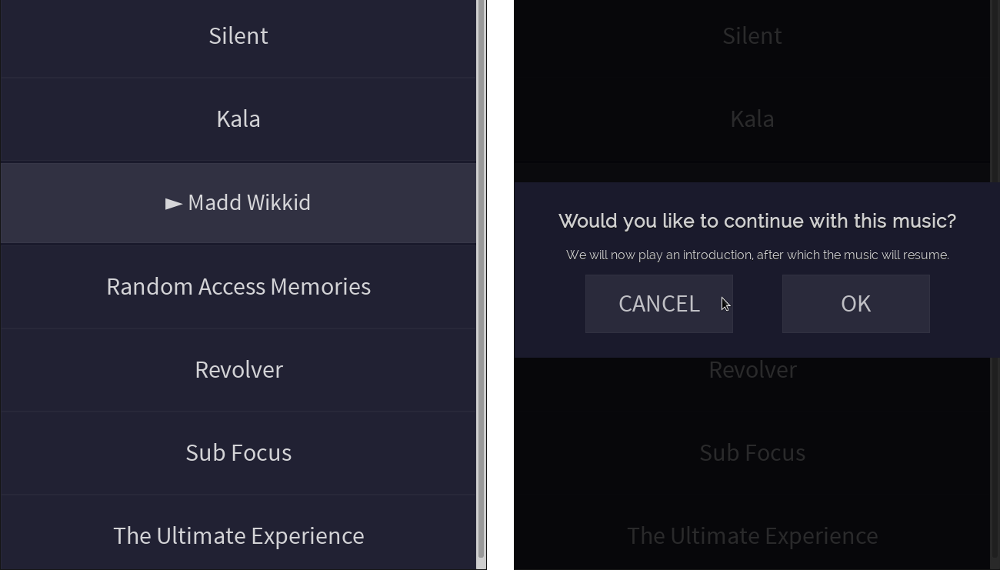

SalonMusicPlayer
================

I've made a music player to suit the needs of a service, where clients privately use a room for a determined amout of time. The client can first choose the mood of music that suits them. There's some good code in here, but not enough to sell to anyone. So I thought I'd open-source it, perhaps get help on improving this while I'm at it.

Features:
---------
* Dead simple for the user - all they see are the playlists
* Client chooses playlist and a random file from inside is played.
* After 10 seconds a popup asks if they want to hear the introduction.
* Session is limited by an invisible timer.
* Music files are picked up from folders automatically.
* You can cuztomize player color nad timer options very easily.

Screenshot
----------

Note
----
If you do use this, I would be very interested in hearing where and how.
